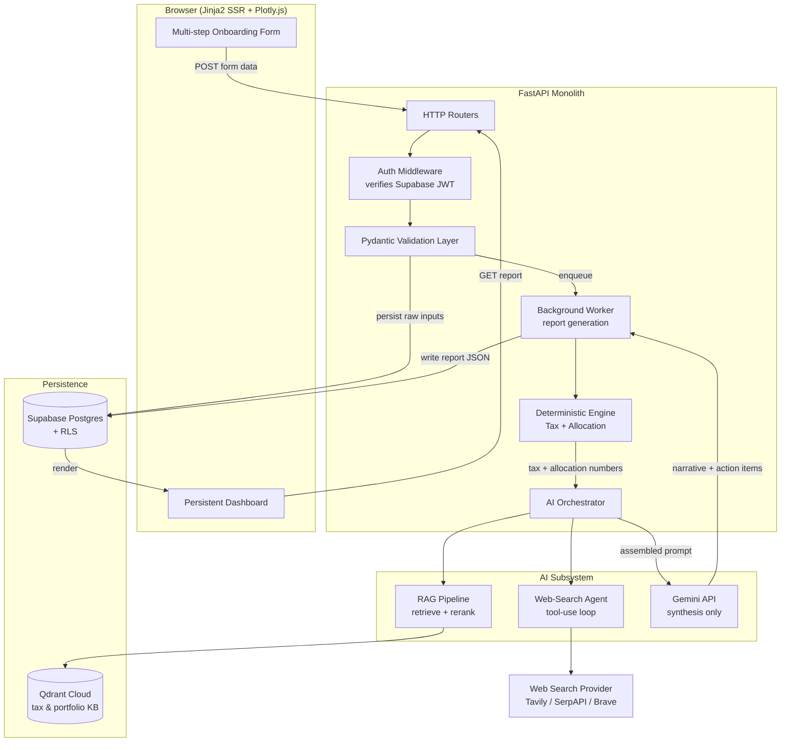
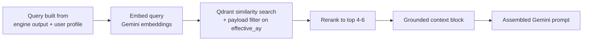

# System Architecture: AI-Driven Personal Finance, Tax & Investment Advisory Platform

**Target Market:** India (FY 2025-26 / AY 2026-27 tax rules, Income Tax Act 2025 effective 1 Apr 2026)
**Stack:** FastAPI + Jinja2 · Supabase (PostgreSQL/Auth/RLS) · Gemini API · Qdrant Cloud · Plotly
**Document type:** Production-grade architecture specification
**Status:** Reference design for implementation

---

## 0. Scope & Reading Guide

This document specifies the end-to-end architecture for a monolithic, server-side-rendered (SSR) advisory platform. The data model is derived directly from the client intake template provided (a household-level Indian financial planning sheet covering demographics, income, expenses, loans, savings, insurance, mutual funds, equities, NPS, and goals). Two design constraints shape everything below:

1. **Financial data is sensitive and per-household.** Every storage and access decision is built around tenant isolation enforced at the database layer (Supabase RLS), not just the application layer.
2. **The LLM advises but does not compute money.** All rupee-denominated tax and allocation figures are produced by deterministic Python, *not* by Gemini. Gemini synthesizes narrative, rationale, and action items around pre-computed numbers. This is the single most important guardrail in the system (see Section E).

---

## A. High-Level Architecture & Component Interaction

### A.1 Component Topology

The system is a FastAPI monolith that orchestrates four external services: Supabase (state + auth), Gemini (LLM synthesis), Qdrant Cloud (RAG vector store), and a Web-Search provider (real-time market data). A background worker (the same FastAPI process via `BackgroundTasks` for MVP, or a separate Celery/Arq worker for scale) handles long-running report generation so HTTP requests never block on Gemini latency.



### A.2 The Layered Responsibility Model

| Layer | Responsibility | Never does |
|---|---|---|
| **Jinja2 / Plotly.js** | Render server-built HTML and hydrate charts from JSON | Compute tax, hold secrets |
| **FastAPI routers** | Auth check, request shaping, enqueue work | Long blocking calls to Gemini |
| **Pydantic validation** | Type/range/business-rule enforcement on every figure | Trust client-supplied totals |
| **Deterministic Engine** | All rupee math: tax (old vs new), allocation, goal funding | Call the LLM |
| **AI Orchestrator** | Gather web + RAG context, assemble prompt, parse Gemini output | Originate financial numbers |
| **Supabase** | Durable per-user state, identity, row-level isolation | Be bypassed by app-level "trust me" queries |

### A.3 Request Lifecycle: Form Submission → Dashboard

The critical insight is that **report generation is asynchronous**. A synchronous request that waits for a web-search agent loop plus a RAG retrieval plus a multi-thousand-token Gemini call will routinely exceed 30–60 seconds and time out behind most reverse proxies. The flow is therefore split into a fast write path and a background compute path.

**Phase 1 — Capture (synchronous, < 500 ms):**
1. User completes the multi-step onboarding form. Each step POSTs to FastAPI; partial state is saved to `financial_inputs` so a half-finished form survives a refresh.
2. On final submit, the Pydantic layer validates every figure (income non-negative, EMI ≤ income sanity checks, dates parseable, percentages in `[0,100]`). Invalid rows are rejected back to the form with field-level errors — nothing reaches the engine unvalidated.
3. The validated payload is written to `financial_inputs` (one JSONB snapshot per submission, versioned) and a row is inserted into `report_jobs` with status `queued`. The endpoint returns immediately with a job id and redirects the browser to the dashboard in a "report generating" state.

**Phase 2 — Compute (background, 10–90 s):**
4. The worker picks up the job and runs the **Deterministic Engine first**: it computes tax liability under both regimes, the recommended asset allocation across Equity/Debt/Real Estate/Metals, current-vs-target allocation gaps, and goal-funding feasibility. These are plain numbers in a Python dict — no AI involved.
5. The **AI Orchestrator** then enriches: the Web-Search Agent fetches current top mutual funds / FD & small-savings rates; the RAG pipeline retrieves relevant tax-law and portfolio-strategy passages from Qdrant.
6. The orchestrator assembles a single structured prompt: deterministic numbers + web findings + RAG passages + a strict output schema. Gemini returns *narrative interpretation and action items only*.
7. The worker assembles the final report object (numbers from the engine, prose from Gemini, chart specs from Plotly), writes it to `tax_reports` and `investment_plans`, and flips the job to `complete`.

**Phase 3 — Render (synchronous, < 800 ms):**
8. The dashboard polls the job status (or uses Server-Sent Events). Once `complete`, FastAPI fetches the report row, builds Plotly figures server-side, serializes them to JSON, and renders the Jinja2 dashboard. Plotly.js hydrates the charts client-side from the embedded JSON.
9. On every subsequent login the same report renders instantly from `tax_reports` — generation does not re-run unless the user edits inputs.

This separation means the user-facing request is always fast, Gemini latency is absorbed by the worker, and a failed AI call degrades to "report pending / partial" rather than a 500 error on form submit.

---

## B. Supabase Database Schema & Security

### B.1 Design Principles

- **`auth.users` is the source of identity.** Supabase Auth owns it; we never duplicate passwords. Every domain table carries a `user_id uuid` (and where relevant a `household_id`) that ties back to `auth.uid()`.
- **Raw intake is stored verbatim, derived reports separately.** The template captures messy household data (a "Sir"/"Mam" two-earner model, dependents, dozens of fund lines). We store the raw submission as a versioned JSONB snapshot *and* normalize the high-value entities (incomes, loans, holdings, goals) into relational tables for querying and engine input. This dual approach preserves the exact submission for audit while keeping queries clean.
- **Reports are immutable per version.** A new submission produces a new `tax_reports`/`investment_plans` row, never an in-place edit — giving the user a history and making regeneration safe.

### B.2 Core Tables

```sql
-- 1. PROFILES: 1:1 extension of auth.users
create table public.profiles (
    id            uuid primary key references auth.users(id) on delete cascade,
    full_name     text,
    household_name text,
    risk_appetite text check (risk_appetite in ('Conservative','Moderate','Aggressive')),
    created_at    timestamptz not null default now(),
    updated_at    timestamptz not null default now()
);

-- 2. HOUSEHOLD MEMBERS: from the template's demographics block
--    (Sir, Mam, Child 1..n, dependent parents, others)
create table public.household_members (
    id            uuid primary key default gen_random_uuid(),
    user_id       uuid not null references auth.users(id) on delete cascade,
    member_role   text not null,           -- 'Sir','Mam','Child','Parent','Other'
    display_name  text,
    age           numeric(5,1),            -- template stores 2.5 etc.
    studies_in_class text,
    financially_dependent boolean default false,
    created_at    timestamptz not null default now()
);

-- 3. FINANCIAL_INPUTS: the versioned raw submission (audit + reproducibility)
create table public.financial_inputs (
    id            uuid primary key default gen_random_uuid(),
    user_id       uuid not null references auth.users(id) on delete cascade,
    version       int  not null default 1,
    raw_payload   jsonb not null,          -- entire validated form snapshot
    submitted_at  timestamptz not null default now(),
    unique (user_id, version)
);

-- 4a. INCOME_SOURCES (Salary, Business, Rental, FD Interest, Other) per earner
create table public.income_sources (
    id          uuid primary key default gen_random_uuid(),
    input_id    uuid not null references public.financial_inputs(id) on delete cascade,
    user_id     uuid not null references auth.users(id) on delete cascade,
    earner      text not null,             -- 'Sir' | 'Mam'
    source_type text not null,             -- 'Salary','Business','Rental','FD Interest','Other'
    monthly_amount numeric(14,2) not null default 0,
    annual_amount  numeric(14,2) generated always as (monthly_amount * 12) stored
);

-- 4b. EXPENSES (Household, Hospital, School, Discretionary, Guest, Business)
create table public.expenses (
    id          uuid primary key default gen_random_uuid(),
    input_id    uuid not null references public.financial_inputs(id) on delete cascade,
    user_id     uuid not null references auth.users(id) on delete cascade,
    category    text not null,
    monthly_amount numeric(14,2) not null default 0
);

-- 4c. LIABILITIES (Home / Personal / Car / Other loans)
create table public.liabilities (
    id            uuid primary key default gen_random_uuid(),
    input_id      uuid not null references public.financial_inputs(id) on delete cascade,
    user_id       uuid not null references auth.users(id) on delete cascade,
    loan_type     text not null,
    owner         text,                    -- 'Sir'|'Mam'|'Joint'
    emi           numeric(14,2) default 0,
    pending_amount numeric(16,2) default 0,
    interest_rate numeric(5,2),
    duration_months int
);

-- 4d. HOLDINGS: unified investments (MF, Shares, NPS, PF/PPF/RD/FD,
--     property, Sukanya, gold, etc.) — asset_class drives allocation math
create table public.holdings (
    id            uuid primary key default gen_random_uuid(),
    input_id      uuid not null references public.financial_inputs(id) on delete cascade,
    user_id       uuid not null references auth.users(id) on delete cascade,
    asset_class   text not null,           -- 'Equity','Debt','RealEstate','Metals','Cash'
    instrument    text not null,           -- e.g. 'Axis Small Cap Fund'
    owner         text,                    -- 'Sir'|'Mam'
    sip_monthly   numeric(14,2) default 0,
    invested_amount numeric(16,2) default 0,
    current_corpus  numeric(16,2) default 0,
    interest_rate numeric(5,2)
);

-- 4e. INSURANCE (Life: Term/ULIP/Endowment, Health, Corporate)
create table public.insurance_policies (
    id            uuid primary key default gen_random_uuid(),
    input_id      uuid not null references public.financial_inputs(id) on delete cascade,
    user_id       uuid not null references auth.users(id) on delete cascade,
    policy_type   text not null,           -- 'Life','Health','Corporate Life','Corporate Health'
    product_name  text,
    structure     text,                    -- 'Term','ULIP','Endowment'
    insured       text,                    -- 'Sir'|'Mam'
    premium       numeric(14,2),
    premium_frequency text,                -- 'Monthly','Quarterly','Half-Yearly','Annually'
    policy_end_date date,
    maturity_amount numeric(16,2)
);

-- 4f. GOALS (New car, home, education, marriage, retirement, world tour...)
create table public.goals (
    id            uuid primary key default gen_random_uuid(),
    input_id      uuid not null references public.financial_inputs(id) on delete cascade,
    user_id       uuid not null references auth.users(id) on delete cascade,
    goal_name     text not null,
    horizon_type  text,                    -- 'Short','Long','Retirement'
    duration_years numeric(5,1),
    amount_required_today numeric(16,2)    -- inflated to future value by the engine
);

-- 5. INVESTMENT_PLANS: engine output (target allocation + recommendations)
create table public.investment_plans (
    id            uuid primary key default gen_random_uuid(),
    user_id       uuid not null references auth.users(id) on delete cascade,
    input_version int  not null,
    target_equity_pct      numeric(5,2),
    target_debt_pct        numeric(5,2),
    target_realestate_pct  numeric(5,2),
    target_metals_pct      numeric(5,2),
    plan_detail   jsonb not null,          -- per-goal funding, rebalancing actions, Plotly specs
    generated_at  timestamptz not null default now()
);

-- 6. TAX_REPORTS: engine output + Gemini narrative
create table public.tax_reports (
    id            uuid primary key default gen_random_uuid(),
    user_id       uuid not null references auth.users(id) on delete cascade,
    input_version int  not null,
    assessment_year text not null default 'AY 2026-27',
    old_regime_tax  numeric(14,2),
    new_regime_tax  numeric(14,2),
    recommended_regime text,
    breakdown     jsonb not null,          -- slab-wise, deductions, surcharge, cess
    ai_narrative  text,                    -- Gemini prose, clearly flagged as advisory
    ai_action_items jsonb,
    generated_at  timestamptz not null default now()
);

-- 7. REPORT_JOBS: async generation tracking
create table public.report_jobs (
    id            uuid primary key default gen_random_uuid(),
    user_id       uuid not null references auth.users(id) on delete cascade,
    input_version int not null,
    status        text not null default 'queued'  -- queued|running|complete|failed
                  check (status in ('queued','running','complete','failed')),
    error_detail  text,
    created_at    timestamptz not null default now(),
    updated_at    timestamptz not null default now()
);
```

**Entity relationships:** `auth.users` → `profiles` (1:1) and → `financial_inputs` (1:many, versioned). Each `financial_inputs` version fans out to `income_sources`, `expenses`, `liabilities`, `holdings`, `insurance_policies`, and `goals` (1:many each, all `on delete cascade`). The engine consumes one input version and writes one `investment_plans` and one `tax_reports` row, linked back by `input_version`.

### B.3 Row-Level Security (RLS)

RLS is the spine of tenant isolation. **Enable it on every table** and write policies so a user can only ever touch rows where `user_id = auth.uid()`. Without RLS, a single ORM bug or a leaked anon key exposes every household's finances.

```sql
-- Enable RLS on all domain tables (repeat per table)
alter table public.profiles            enable row level security;
alter table public.household_members   enable row level security;
alter table public.financial_inputs    enable row level security;
alter table public.income_sources      enable row level security;
alter table public.expenses            enable row level security;
alter table public.liabilities         enable row level security;
alter table public.holdings            enable row level security;
alter table public.insurance_policies  enable row level security;
alter table public.goals               enable row level security;
alter table public.investment_plans    enable row level security;
alter table public.tax_reports         enable row level security;
alter table public.report_jobs         enable row level security;

-- Profiles: a user owns exactly their row (id == auth.uid())
create policy "own profile - select" on public.profiles
    for select using ( auth.uid() = id );
create policy "own profile - upsert" on public.profiles
    for insert with check ( auth.uid() = id );
create policy "own profile - update" on public.profiles
    for update using ( auth.uid() = id ) with check ( auth.uid() = id );

-- Pattern for every user-scoped table (example: holdings)
create policy "own holdings - select" on public.holdings
    for select using ( auth.uid() = user_id );
create policy "own holdings - insert" on public.holdings
    for insert with check ( auth.uid() = user_id );
create policy "own holdings - update" on public.holdings
    for update using ( auth.uid() = user_id ) with check ( auth.uid() = user_id );
create policy "own holdings - delete" on public.holdings
    for delete using ( auth.uid() = user_id );

-- Reports are READ-ONLY to the user; only the backend service writes them.
create policy "own tax_report - select" on public.tax_reports
    for select using ( auth.uid() = user_id );
-- No user insert/update/delete policy on tax_reports / investment_plans:
-- writes happen via the service_role key in the trusted worker, which
-- bypasses RLS by design.
```

**Critical operational rules:**

- **Two keys, two trust levels.** The browser/Jinja layer only ever uses the **anon key**, so RLS is always in force for user-driven reads. The background worker uses the **`service_role` key**, which *bypasses RLS* — this is intentional and is why the worker (never the browser) writes `tax_reports`/`investment_plans`. The `service_role` key must live only in server-side environment variables, never in a template or client bundle.
- **`with check` on writes prevents `user_id` spoofing.** Without it, a user could insert a row stamped with someone else's `user_id`.
- **Always default `user_id` from the JWT, never the request body.** In the FastAPI layer, derive `user_id` from the verified Supabase JWT (`auth.uid()`), and set it server-side. Treat any client-supplied `user_id` as untrusted.
- **Index `user_id` on every table** — RLS turns `user_id` into a filter on essentially every query, so it must be indexed (`create index on public.holdings (user_id);`).

---

## C. AI Agent & RAG Pipeline Design

The AI subsystem has three cooperating parts: a **Web-Search Agent** (fresh, external, fast-changing facts), a **RAG pipeline** (stable internal domain knowledge), and **Gemini** as the synthesis engine. They feed a single assembled prompt. The division of labour matters: web search is for *what the market is doing right now*, RAG is for *what the rules and strategies are*, and the deterministic engine is for *what the user's numbers actually are*.

### C.1 Web-Search Agent

**Purpose:** Retrieve current top-performing mutual funds (by category and horizon), prevailing fixed-income rates (FD, RD, small-savings like PPF/Sukanya, NPS tier returns), and current market options relevant to the user's risk profile and goals.

**Framework choice.** Use Gemini's native **function-calling (tool-use)** loop rather than a heavy agent framework. The orchestrator exposes a small, typed tool surface and lets Gemini decide which to call, but caps the loop to keep latency and cost bounded.

```python
# Tool surface exposed to Gemini (function declarations)
TOOLS = [
  {
    "name": "search_top_funds",
    "description": "Find current top-performing mutual funds for a category/horizon.",
    "parameters": {
      "type": "object",
      "properties": {
        "category": {"type": "string",
            "enum": ["LargeCap","MidCap","SmallCap","FlexiCap","Index","ELSS","Debt","Hybrid"]},
        "horizon_years": {"type": "integer"},
        "risk": {"type": "string", "enum": ["Conservative","Moderate","Aggressive"]}
      },
      "required": ["category"]
    }
  },
  {
    "name": "get_fixed_income_rates",
    "description": "Current FD / RD / PPF / Sukanya / NPS / SCSS rates.",
    "parameters": {"type": "object",
      "properties": {"instrument": {"type": "string"}}, "required": ["instrument"]}
  }
]
```

**Search orchestration:**
1. The orchestrator pre-derives *which* searches are needed from the engine output — e.g. if the target allocation says the household is underweight large-cap equity, it requests `search_top_funds(category="LargeCap")`. This means the agent rarely free-explores; it executes a planned shortlist.
2. Each tool maps to a concrete web-search provider call (Tavily / Brave / SerpAPI). Results are **scraped down to structured facts** (fund name, 3Y/5Y CAGR, expense ratio, AUM; or rate %) before they ever reach Gemini — Gemini receives clean JSON, not raw HTML.
3. **Hard bounds:** maximum N tool calls per report (e.g. 5), a per-call timeout (e.g. 8 s), and a global agent budget (e.g. 25 s). If the budget is exhausted, the report proceeds with whatever was gathered and notes "live market data partially unavailable."
4. **Caching:** market rates and top-fund lists change slowly relative to user sessions. Cache results in a `market_data_cache` table (or Redis) keyed by `(tool, params, date)` with a TTL of a few hours. This collapses cost dramatically when many users generate reports the same day.
5. **Recency & trust:** prefer AMC sites, AMFI, RBI, and exchange sources over aggregators; attach the source URL and fetch date to every fact so the dashboard can cite them and the user can verify.

### C.2 RAG Pipeline (Qdrant Cloud)

**Purpose:** Ground Gemini in authoritative internal knowledge — Indian tax law (slabs, deductions under the new vs old regime, capital-gains treatment, Section 80C/80D applicability, the Income Tax Act 2025 changes) and portfolio-management strategy (asset-allocation frameworks, rebalancing rules, goal-based investing playbooks).

**Vector storage design in Qdrant:**
- **Collection layout:** two logical corpora — `tax_law_kb` and `portfolio_strategy_kb` — implemented either as separate collections or one collection partitioned by a `corpus` payload field. Separate collections is cleaner: it lets you tune retrieval per corpus and re-index tax law independently when a Budget changes.
- **Payload schema per point:** `{ corpus, doc_title, section, jurisdiction:'IN', effective_ay, source_url, last_reviewed, text }`. The `effective_ay` field is essential — tax passages must be filterable to the relevant assessment year so a query for AY 2026-27 never retrieves a stale FY 2023-24 slab table.
- **Filtering:** use Qdrant payload filters at query time (`corpus = 'tax_law_kb' AND effective_ay = 'AY 2026-27'`) so retrieval is both semantically and factually scoped.
- **Distance metric:** cosine, standard for normalized text embeddings.

**Embedding strategy:**
- **Chunking:** split source documents *semantically* — by section/clause for tax law (each deduction or slab table as its own chunk), by concept for strategy docs — targeting ~300–500 tokens with ~50-token overlap. Tax law especially must not be chunked mid-clause, or retrieval returns half a rule.
- **Embedding model:** use Gemini's embedding model (e.g. `gemini-embedding-2` / `gemini-embedding`) for both indexing and queries so the vector spaces match. Store the model name in collection metadata; if you ever change models you must re-embed the whole corpus.
- **Hybrid retrieval + rerank:** retrieve top-k (k≈20) by vector similarity with payload filters, then rerank to the top 4–6 passages actually injected into the prompt. This keeps the prompt tight and pushes the most on-point clauses to the top.
- **Freshness governance:** tax content carries `last_reviewed` and `effective_ay`. A scheduled job (post-Budget, annually) re-indexes the tax corpus. The RAG layer should refuse to surface tax passages whose `effective_ay` doesn't match the report's assessment year.



### C.3 Blending Structured Data + Web Search + RAG into One Prompt

The orchestrator builds a **single, sectioned prompt** with clear provenance for every block, so Gemini can tell verified numbers from retrieved knowledge from live data — and so it knows what it is *not* allowed to recompute.

```
[SYSTEM]
You are a financial-advisory writing assistant for the Indian market.
You explain and recommend; you NEVER recalculate or invent monetary figures.
All rupee amounts, tax numbers, and allocation percentages in [VERIFIED FACTS]
are computed and final. If a number is not in [VERIFIED FACTS], say it is not
available — do not estimate it. Cite tax rules only from [KNOWLEDGE BASE].
Output strictly in the JSON schema given in [OUTPUT FORMAT].

[VERIFIED FACTS]  (deterministic engine — authoritative, do not alter)
- Gross income (Sir + Mam): ₹33,00,000  | Taxable: ...
- Tax: Old regime ₹X ; New regime ₹Y ; Recommended: New (saves ₹Z)
- Current allocation: Equity 71% / Debt 18% / RealEstate 9% / Metals 0% / Cash 2%
- Target allocation (Moderate, 10-17y goals): Equity 60 / Debt 25 / RealEstate 10 / Metals 5
- Goal funding gaps: Home(10y) shortfall ..., Retirement(17y) on-track ...

[LIVE MARKET DATA]  (web-search agent — current, cite sources)
- Top LargeCap funds (5Y CAGR): ... [source, fetched 2026-05-26]
- PPF 7.1%, SCSS 8.2%, 5Y FD 7.0% ... [source]

[KNOWLEDGE BASE]  (RAG from Qdrant — authoritative for RULES only)
- New regime slabs AY 2026-27; 87A rebate up to ₹12L; std deduction ₹75k ...
- 80C/80D applicability under old regime; LTCG on equity treatment ...

[OUTPUT FORMAT]
{ "summary": str, "tax_explanation": str, "regime_recommendation": str,
  "rebalancing_actions": [ {action, instrument, rationale, source?} ],
  "goal_action_items": [ {goal, status, suggested_monthly_sip} ],
  "disclaimers": [str] }
```

**Why this structure works:** numbers are quarantined in `[VERIFIED FACTS]` and explicitly marked immutable; the model's job is narrative around them. Live data and rules are separated so the model cites the right source type. The forced JSON schema makes the output machine-parseable into the dashboard and lets the worker validate that Gemini didn't smuggle in a different tax number (see Section E.2).

---

## D. Frontend Integration (FastAPI + Jinja2 + Plotly)

### D.1 The Right Way to Move Plotly Figures into Jinja2

**Recommendation: server-side JSON serialization with client-side hydration. Do not use iframes, and do not render static images.**

The pattern: build the `plotly.graph_objects.Figure` in FastAPI, serialize it to JSON with Plotly's own encoder, pass that JSON string into the template, and let `Plotly.newPlot` hydrate a `<div>` on the client.

```python
# FastAPI side
import plotly.graph_objects as go
import plotly.io as pio

def build_allocation_fig(plan) -> str:
    fig = go.Figure(data=[go.Pie(
        labels=["Equity","Debt","Real Estate","Metals","Cash"],
        values=[plan.equity, plan.debt, plan.realestate, plan.metals, plan.cash],
        hole=0.45)])
    fig.update_layout(margin=dict(t=10,b=10,l=10,r=10), showlegend=True)
    return pio.to_json(fig)          # -> JSON string, exact figure spec

@app.get("/dashboard")
async def dashboard(request: Request, user=Depends(current_user)):
    report = await fetch_report(user.id)             # from tax_reports / investment_plans
    return templates.TemplateResponse("dashboard.html", {
        "request": request,
        "alloc_fig": build_allocation_fig(report.plan),
        "tax_fig":   build_tax_breakdown_fig(report),
    })
```

```html
<!-- dashboard.html (Jinja2) -->
<div id="allocChart" style="width:100%;height:380px;"></div>
<script src="https://cdn.plot.ly/plotly-2.x.min.js"></script>
<script>
  // {{ alloc_fig | safe }} is a JSON object {data, layout} produced by pio.to_json
  const alloc = {{ alloc_fig | safe }};
  Plotly.newPlot('allocChart', alloc.data, alloc.layout, {responsive:true});
</script>
```

**Why this beats the alternatives:**

| Approach | Verdict | Reason |
|---|---|---|
| **`pio.to_json` + `Plotly.newPlot`** ✅ | **Use this** | Figure built once server-side; client receives a compact JSON spec and renders interactively. Charts stay zoom/hover-interactive, page stays a single SSR document, no extra network round-trip. |
| `fig.to_html(full_html=False)` | Acceptable for one-off | Injects a full script blob per chart; heavier, harder to theme consistently, duplicates the Plotly bundle if misused. |
| **iframe per chart** ❌ | Avoid | Each iframe is a separate document load → extra requests, broken responsive layout, awkward theming, and a real page-load hit with several charts. |
| Static PNG (`fig.to_image`) ❌ | Avoid | Kills interactivity (no hover on tax breakdown / allocation), requires `kaleido`, and adds server render cost. |

**Performance specifics:**
- **Load Plotly once** from CDN (or a single bundled asset) in the base template — never per chart. Use the partial `plotly-basic` bundle if you only need pie/bar/line, cutting payload by more than half.
- **Serialize on the server, hydrate on the client.** The figure JSON for an allocation pie or a slab-wise bar chart is a few KB — trivial inline. Don't ship raw holdings rows to the client and compute charts in JS; that leaks data and duplicates logic.
- **Lazy-render below-the-fold charts.** For a long dashboard (allocation, tax breakdown, goal timelines, net-worth trend), render the first chart immediately and initialize the rest with an `IntersectionObserver` so initial paint isn't blocked.
- **Cache the serialized figure JSON** alongside the report in `investment_plans.plan_detail` so re-renders on later logins skip figure reconstruction entirely.

### D.2 Multi-Step Form UX

The onboarding form mirrors the template's sections (Demographics → Income → Expenses → Loans → Savings/Investments → Insurance → Goals → Risk profile). Persist each step server-side to `financial_inputs` partial state on step transition so a refresh or a dropped connection never loses a half-entered household sheet. Render server-side per step (classic SSR) with progressive enhancement; this keeps the app a true FastAPI+Jinja2 monolith and avoids a SPA dependency.

---

## E. Edge Cases & Guardrails

### E.1 Gemini Rate Limits & Timeouts During Heavy Report Generation

**The architectural answer is the async worker from Section A** — Gemini is never on the synchronous request path, so a slow or rate-limited call degrades the *report*, not the *site*. On top of that:

- **Retry with exponential backoff + jitter** on `429`/`503`/timeout, capped (e.g. 3 attempts, 1s→2s→4s + jitter). Respect any `Retry-After` hint.
- **Concurrency limiting / token-bucket** in the worker so the system stays under the project's Gemini quota even under a burst of simultaneous submissions. A simple in-process semaphore for MVP; a shared Redis token bucket when horizontally scaled.
- **Request queue with backpressure.** Because every report is a `report_jobs` row, a spike just lengthens the queue rather than triggering a thundering herd of API calls. Show the user an honest "generating, ~1 min" state with polling/SSE.
- **Prompt-size discipline** to avoid timeouts and cost blowups: RAG injects only the top 4–6 reranked passages, web data is pre-summarized to structured facts, and engine output is compact. Smaller prompts = faster, cheaper, more reliable completions.
- **Caching at two levels:** (a) market data cache (Section C.1) so repeat searches are free; (b) **idempotent report generation** — if inputs haven't changed since the last successful report, serve the stored report instead of regenerating.
- **Graceful degradation ladder:** full report → report with "live market data unavailable" → "numbers ready, narrative pending (retry shortly)". The deterministic tax and allocation numbers are *always* available because they don't depend on Gemini, so the user always sees something useful.
- **Timeouts everywhere:** explicit client timeouts on the Gemini call, the web-search calls, and the Qdrant query, each shorter than the worker's overall job timeout, so one stuck dependency can't hang a job indefinitely.

### E.2 Data Validation & Preventing Hallucinated Tax Advice

This is the part that protects users from wrong financial guidance. Defense is layered:

**Input validation (before anything runs):**
- **Pydantic models with strict types and ranges** on every field: amounts `>= 0`, interest rates in `[0,30]`, percentages in `[0,100]`, ages plausible, dates parseable, allocation inputs summing sanely. Use `Decimal` for money — never float — to avoid rounding drift in tax math.
- **Cross-field business rules:** flag (don't silently accept) red flags like total EMIs exceeding income, or current corpus < invested amount on every holding, or a term policy with a maturity amount. These get surfaced to the user for confirmation rather than fed blindly to the engine.
- **Reject, don't coerce.** Invalid figures bounce back to the form with field-level messages; the engine only ever sees clean data.

**The core anti-hallucination guarantee — the LLM never produces numbers:**
- **All tax and allocation math is deterministic Python**, computed *before* Gemini is called, using the verified FY 2025-26 / AY 2026-27 rules:
  - New regime slabs: 0% up to ₹4L, 5% ₹4–8L, 10% ₹8–12L, 15% ₹12–16L, 20% ₹16–20L, 25% ₹20–24L, 30% above ₹24L; Section 87A rebate making income up to ₹12L effectively tax-free (₹12.75L for salaried after the ₹75,000 standard deduction); 4% health & education cess; surcharge slabs (capped at 25% under the new regime).
  - Old regime computed in parallel with its slabs plus eligible 80C/80D/HRA-style deductions for the comparison.
  - These rules live in a **versioned, unit-tested rules module** keyed by assessment year — not in a prompt — so they're auditable and testable against known examples. (The Income Tax Act 2025 takes effect 1 Apr 2026 but does not change the AY 2026-27 slab rates; the module should encode AY as the key so future-year changes are a data change, not a code rewrite.)
- **Gemini's role is bounded to narrative.** The prompt (Section C.3) explicitly forbids recomputation and instructs the model to refuse to state any number not present in `[VERIFIED FACTS]`.

**Output validation (after Gemini responds):**
- **Schema validation:** parse Gemini's JSON against the expected schema; reject and retry on malformed output.
- **Numeric consistency check:** programmatically scan the narrative for any rupee figures and assert they match the engine's `[VERIFIED FACTS]`. If Gemini introduces a tax number that wasn't computed, the worker rejects that field (and either retries with a stricter instruction or strips the offending claim). This is the concrete mechanism that stops a hallucinated tax figure from ever reaching the dashboard.
- **RAG-grounding for rules:** tax-rule statements in the narrative should be traceable to retrieved KB passages; un-grounded rule claims are flagged.

**Product-level guardrails:**
- **Persistent disclaimers** rendered on the dashboard: this is algorithmic guidance, not a substitute for a registered investment adviser / chartered accountant; verify before acting; market data as-of timestamp shown.
- **Source citations** on every live data point and tax rule so the figure is verifiable, not just asserted.
- **Audit trail:** the stored `financial_inputs` version, the engine output, the web/RAG context, and the Gemini response are all retained per report, so any recommendation can be reconstructed and explained later.

---

## Appendix: Worked Example From the Provided Template

Using the sample household in the intake sheet (Sir salary ₹1,80,000/mo, Mam ₹95,000/mo → gross ≈ ₹33,00,000/yr), the pipeline would: compute old vs new regime liability deterministically; observe a current portfolio that is heavily equity-weighted (≈18 mutual funds plus direct equity, NPS, PF/PPF/RD/FD, land) with **zero metals allocation**; flag the goal set (₹50L Pune home in 10y, ₹3Cr retirement in 17y, children's education and marriage) against current SIP capacity; and have Gemini narrate *why* the recommended regime and a rebalancing toward target Equity/Debt/Real Estate/Metals weights make sense — citing current top funds and small-savings rates from the web-search agent and tax treatment from the RAG KB, with every rupee figure originating from the engine, not the model.
